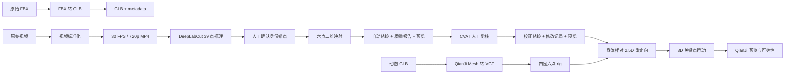

# qianji-animal-motion

QianJi 仿生运动研究的动物数据准备工具。项目把静态 3D Mesh 和动物视频整理
为可追溯、可检查、可回退的中间结果：

- 将 FBX 转换为经过结构验证的二进制 glTF 2.0（GLB）。
- 将视频标准化为 30 FPS、720p、H.264 MP4。
- 将 DeepLabCut SuperAnimal-Quadruped 的 39 点 H5 映射为六点二维轨迹。
- 将六点轨迹导入 CVAT 人工复核，再导回独立版本。
- 将六点的身体相对二维运动重定向到由动物 Mesh 生成的 QianJi 四足 rig。

原始 FBX、视频和 39 点 H5 均不会被修改。多文件结果采用暂存后整体发布，
中途失败不会留下半套产物；每轮人工校正也不会覆盖自动基线。

> **当前边界：** 二维轨迹仍是原始观测。新增的三维结果是身体相对的 2.5D
> 重定向：Mesh rig 提供中性三维位置，视频只提供躯干纵向和竖直方向的相对
> 变化。它不是相机标定后的世界坐标或单目深度估计。详见
> [实验说明](docs/experimental_2d_to_3d_mesh.md)和
> [数据契约](docs/data_contract.md)。

## 处理流程



DeepLabCut 模型下载和 39 点推理由 DeepLabCut 完成。本仓库保留其 H5 输出，
并从 H5 开始负责语义映射、质量检查和人工校正。

## 六点定义

| 名称 | 含义 |
| --- | --- |
| `spine_front` | 躯干前部 |
| `spine_rear` | 躯干后部 |
| `front_left_foot` | 动物左前足 |
| `front_right_foot` | 动物右前足 |
| `rear_left_foot` | 动物左后足 |
| `rear_right_foot` | 动物右后足 |

左右始终以动物自身方向为准，不是观察者看到的画面左右。

## 环境

要求 Python 3.12 和 FFmpeg/FFprobe。FBX 转换还需要 Assimp。

推荐使用 Conda 或 Mamba 创建完整环境：

```bash
mamba env create -f environment.yml
mamba activate animal_pose
```

已有 Python 3.12 环境时，仅安装数据处理与测试依赖：

```bash
pip install -e '.[dev]'
```

同时安装 DeepLabCut 3.0.0 model zoo 和 GUI：

```bash
pip install -e '.[dlc,gui,dev]'
```

安装 Assimp：

```bash
# macOS
brew install assimp

# Ubuntu / Debian
sudo apt install assimp-utils
```

验证安装：

```bash
pytest
python -c "from qianji_animal_motion import __version__; print(__version__)"
```

## 目录

```text
qianji-animal-motion/
├── configs/                         配置文件
├── data/
│   ├── raw/                         原始 FBX 和视频
│   └── processed/                   GLB 和标准化视频
├── docs/
│   ├── cvat_manual_correction.md    CVAT 操作教程
│   ├── data_contract.md             二维与三维输出契约
│   └── experimental_2d_to_3d_mesh.md  Mesh 重定向实验说明
├── outputs/
│   ├── zero_shot/                   DeepLabCut 原始 39 点预测
│   ├── anchor_review/               身份锚点候选
│   ├── semantic_six/                自动六点结果
│   └── manual_correction/           CVAT 人工校正版本
├── src/qianji_animal_motion/        项目源码
└── tests/                           自动化测试
```

`data/` 和 `outputs/` 中的实际数据、模型和媒体均由 `.gitignore` 排除，不会
提交到 Git；仓库只保留空目录占位文件。

## 1. FBX 转 GLB

转换单个文件：

```bash
qianji-convert-mesh data/raw/cat.fbx \
  --output data/processed/cat.glb
```

批量转换目录：

```bash
qianji-convert-mesh data/raw \
  --output data/processed
```

程序固定请求二进制 glTF 2.0，并检查 Mesh、顶点、三角面和有限的
POSITION accessor 包围盒。这里的包围盒是 GLB accessor 局部数据，不等同于
应用完整节点变换后的世界包围盒。输出还包含 `.metadata.json`，其中记录
Assimp 版本、输入哈希和结构统计。默认拒绝覆盖；确认替换时使用
`--overwrite`。

## 2. 视频标准化

进入 DeepLabCut 前，将视频统一为恒定帧率、720p、H.264、`yuv420p` 且无
音频的 MP4。画面不会被裁剪。

```bash
qianji-preprocess-video data/raw/cat_walk.mov \
  --output data/processed/cat_walk_30fps_720p.mp4
```

批量处理：

```bash
qianji-preprocess-video data/raw \
  --output data/processed
```

可通过 `--fps`、`--height`、`--crf` 和 `--preset` 调整参数。输出旁边的
`.metadata.json` 保存输入哈希、编码设置以及转换前后的视频属性。输出必须
使用 `.mp4` 扩展名，默认拒绝覆盖；确认重跑时使用 `--overwrite`。

## 3. DeepLabCut 39 点推理

使用 DeepLabCut 3.0.0 的 SuperAnimal-Quadruped 对标准化视频进行推理，把
原始 H5 保存在：

```text
outputs/zero_shot/<video_name>/
```

不要手工改写 H5。后续命令会读取并校验它的 SHA-256，但不会修改它。模型
权重、推理配置和具体 H5 文件名由本次 DeepLabCut 任务决定，因此在后续命令
中传入实际路径。

## 4. 生成身份锚点

先生成最多 12 个腿部置信度高、左右足分离清楚的候选帧：

```bash
qianji-suggest-anchor \
  --video data/processed/cat_walk_30fps_720p.mp4 \
  --predictions outputs/zero_shot/cat_walk/predictions.h5 \
  --camera-side unknown \
  --output outputs/anchor_review/cat_walk
```

`--camera-side` 必须明确填写：

- `animal_left_visible`：镜头主要看到动物左侧。
- `animal_right_visible`：镜头主要看到动物右侧。
- `unknown`：单凭当前素材无法可靠确认。

使用 `unknown` 不会伪造结论，但左右标签只能视为待复核假设。程序生成：

```text
outputs/anchor_review/cat_walk/
├── identity_anchor_candidates.jpg
└── identity_anchor_candidates.json
```

打开拼图，选择一帧能以动物自身方向判断四条腿的画面，并确认 DLC 的前腿和
后腿标签应保持（`keep`）还是交换（`swap`）。Manifest 绑定视频与 H5 哈希，
源文件在生成期间发生变化会直接终止。

## 5. 六点语义映射

将上一步 manifest 中实际存在的候选帧传给 `--anchor-frame`。下面的 `152`
只是本项目当前样例候选，不是所有视频的固定值：

```bash
qianji-map-keypoints \
  --video data/processed/cat_walk_30fps_720p.mp4 \
  --predictions outputs/zero_shot/cat_walk/predictions.h5 \
  --anchor-manifest outputs/anchor_review/cat_walk/identity_anchor_candidates.json \
  --anchor-frame 152 \
  --front-anchor keep \
  --rear-anchor keep \
  --output outputs/semantic_six/cat_walk
```

程序从锚点向视频前后双向追踪前、后腿身份，并检查：

- 背部折线及两个躯干点的结构关系。
- 足端与大腿、膝关节的结构关系。
- 左右足身份在整段时序中的连续性。
- 低置信度、越界、异常跳变和身份模糊。
- 已由可靠帧校准的同帧躯干备用来源。

不可靠点会输出 `valid: false`，坐标为 `null`，并保留原因 `flags`。自动过程
不跨帧插值或平滑。输出：

```text
outputs/semantic_six/cat_walk/
├── keypoint_trajectory_2d.json
├── mapping_report.json
└── six_keypoints_preview.mp4
```

务必完整观看预览。默认拒绝覆盖；确认替换时使用 `--overwrite`。

## 6. CVAT 人工复核

先生成 CVAT 导入包：

```bash
qianji-export-cvat \
  --video data/processed/cat_walk_30fps_720p.mp4 \
  --trajectory outputs/semantic_six/cat_walk/keypoint_trajectory_2d.json \
  --report outputs/semantic_six/cat_walk/mapping_report.json \
  --output outputs/manual_correction/cat_walk/cvat_export
```

导出包包含逐帧 Skeleton XML、输入哈希 manifest、Skeleton 定义和
`review_queue.json`。复核队列优先列出无效点、身份模糊、身份修正边界，以及
备用来源区间的起点、中点和终点，避免只看报错帧而漏掉长期 fallback。

在 CVAT 中以 `CVAT for video 1.1` 导入、修改并导出 XML，然后导回新目录：

```bash
qianji-import-cvat \
  --video data/processed/cat_walk_30fps_720p.mp4 \
  --baseline outputs/semantic_six/cat_walk/keypoint_trajectory_2d.json \
  --manifest outputs/manual_correction/cat_walk/cvat_export/cvat_manifest.json \
  --annotations ~/Downloads/annotations.xml \
  --output outputs/manual_correction/cat_walk/review_v1
```

输出：

```text
review_v1/
├── keypoint_trajectory_2d_corrected.json
├── corrections.json
├── correction_report.json
└── six_keypoints_corrected_preview.mp4
```

每轮使用新的 `review_v2`、`review_v3` 目录。人工修改点保留原模型
`confidence`，同时写入 `position_source: manual`；因此下游不能把模型
置信度误认为人工置信度。完整步骤见
[CVAT 六点人工校正教程](docs/cvat_manual_correction.md)。

## 7. 重定向到 QianJi 四足 rig

先在 QianJi 中从同一动物 GLB 生成 `robot.json`，并用
`quadruped_bbox` 生成六点 `rig_keypoints.json`。然后运行：

```bash
qianji-lift-keypoints \
  --trajectory outputs/manual_correction/cat_walk/review_v2/keypoint_trajectory_2d_corrected.json \
  --robot-json path/to/qianji/morphology/robot.json \
  --rig path/to/qianji/rig_keypoints.json \
  --output outputs/experiments/cat_lift_scale_010 \
  --motion-scale 0.10
```

输出 `keypoint_motion.json`、`mesh_binding.json` 和 `lift_report.json`。
第一个文件可直接交给 QianJi 的关键点预览与几何可达性工具；另外两个文件
记录中性位置、坐标基、源文件哈希、假设和无效点替代。默认使用
`identity_anchor.frame_idx` 作为中性参考帧并拒绝覆盖。

本仓库的真实小猫复现实验及尺度比较见
[实验说明](docs/experimental_2d_to_3d_mesh.md)。

## 数据安全与版本

三层轨迹始终分开：

```text
outputs/zero_shot/              原始 39 点 H5
outputs/semantic_six/           自动六点基线
outputs/manual_correction/      一个或多个人工版本
```

- 自动轨迹 schema 版本为 `1.2.0`。
- 有人工修改的轨迹 schema 版本为 `1.3.0`。
- 无人工修改的 CVAT 往返保持原基线不变。
- 导出和导回会校验相关输入哈希。
- 相关文件整体发布，失败时回滚已发布文件。

回退时只需把下游输入改回自动基线或某个 `review_vN`，不需要重新运行
DeepLabCut。

## 常用命令

```bash
qianji-convert-mesh --help
qianji-preprocess-video --help
qianji-suggest-anchor --help
qianji-map-keypoints --help
qianji-export-cvat --help
qianji-import-cvat --help
qianji-lift-keypoints --help
pytest
```

GitHub Actions 会在 push 和 pull request 上使用 Python 3.12 跑完整测试。

## 与 QianJi 集成

本仓库是 QianJi 上游的数据准备层，不复制上游 DeepLabCut 或 QianJi 源码。
二维证据可以通过本仓库的受限 2.5D 适配器进入 QianJi；需要真实世界运动时，
仍应按 [数据契约](docs/data_contract.md) 增加相机标定、多视角或经过验证的
三维估计。

## License

[MIT](LICENSE)
